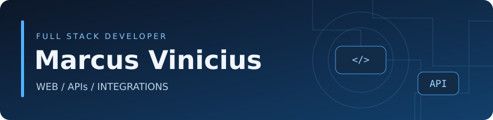
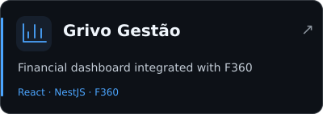
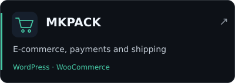
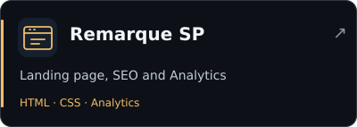
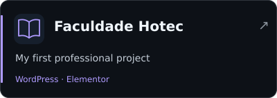
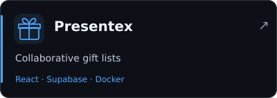
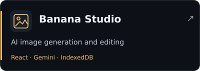
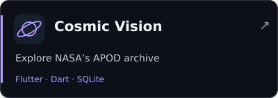
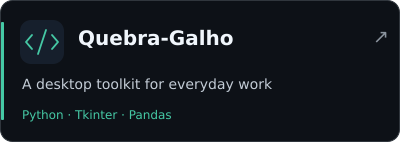

<strong>Mid-level Full Stack Developer</strong> Web applications · Integrations · Digital products

  
  
  

<a href="README.md">Português</a> · <strong>English</strong>

I’m a Mid-level Full Stack Developer at [Alfa Consultoria SAP](https://alfaerp.com.br/), working on web portals and APIs integrated with **SAP Business One**. I also build **freelance projects**: financial dashboards, institutional websites and e-commerce stores.

## 🛠️ Technologies

<strong>Web, backend and data</strong>

  <picture>
    <source media="(prefers-color-scheme: dark)" srcset="https://skillicons.dev/icons?i=ts%2Cjs%2Creact%2Cnextjs%2Ctailwind%2Cnodejs%2Cnestjs%2Cpostgres&amp;theme=dark&amp;perline=8">
    
  </picture>

<strong>Infrastructure, automation and other experience</strong>

  <picture>
    <source media="(prefers-color-scheme: dark)" srcset="https://skillicons.dev/icons?i=docker%2Clinux%2Ccloudflare%2Cwordpress%2Cpy%2Cflutter%2Ccs%2Cdotnet&amp;theme=dark&amp;perline=8">
    
  </picture>

  <picture>
    <source media="(prefers-color-scheme: dark)" srcset="https://skillicons.dev/icons?i=vite%2Cmysql%2Csupabase%2Cnginx%2Cgit%2Cgithub%2Cdart%2Cphp&amp;theme=dark&amp;perline=8">
    
  </picture>

SAP Business One / Service Layer · SQL Server · MySQL · Supabase · WooCommerce

## 💼 At Alfa

- **Business portals:** React/TypeScript, NestJS APIs and SAP Business One integrations.
- **Purchasing and expenses:** requests, quotations, orders, approvals and reimbursements.
- **Automation and operations:** spreadsheet imports, data processing and label tools.

## 🚀 Professional work

  
  

  
  

<strong>See my contribution to each project</strong>

| Project | My contribution |
| --- | --- |
| **Grivo Gestão** | A financial dashboard integrated with the F360 API, using a NestJS backend, React/Vite frontend and pnpm/Turborepo monorepo. |
| [MKPACK](https://mkpack.marcuspaixao.com.br) | A WordPress/WooCommerce store with Mercado Pago payment and Melhor Envio shipping integrations. |
| [Remarque SP](https://remarquesp.com.br/) | An HTML/CSS landing page with SEO configuration, Google Ads preparation and Analytics integration. |

My first professional project was the **Faculdade Hotec** website, built with WordPress, Elementor and WooCommerce. The [preserved portfolio version](https://hotec.marcuspaixao.com.br/) documents that stage of my career.

[Explore these projects in my portfolio →](https://marcuspaixao.com.br)

## 📂 Open-source projects

  
  

  
  

<strong>Explore features, stack and more projects</strong>

| Project | What I built | Stack |
| --- | --- | --- |
| [Presentex](https://github.com/Vini-Paixao/Presentex) | Collaborative gift lists, authentication, product data scraping and WhatsApp notifications. | React · TypeScript · Supabase · Docker |
| [Banana Studio](https://github.com/Vini-Paixao/Banana-Studio) | Image generation and editing with Gemini, with a gallery persisted in the browser using IndexedDB. | React · TypeScript · Gemini API |
| [Cosmic Vision](https://github.com/Vini-Paixao/Cosmic-Vision) | A mobile app to explore NASA's APOD archive, with favorites, downloads and local persistence. | Flutter · Dart · SQLite |
| [Quebra-Galho](https://github.com/Vini-Paixao/Quebra-Galho) | A desktop toolkit for SQL, XML/JSON, dates and data exports, built around needs encountered at work. | Python · Tkinter · Pandas |

More projects: [Finz](https://github.com/Vini-Paixao/Finz), featuring financial management and Pluggy integration; [API-SP](https://github.com/Vini-Paixao/API-SP), a calendar API with web scraping; and [PimVIII API](https://github.com/Vini-Paixao/PimVIII-API), an academic project built with ASP.NET Core and PostgreSQL.

## 📊 GitHub in numbers

  <picture>
    <source media="(prefers-color-scheme: dark)" srcset="https://github-stats-extended.vercel.app/api?username=Vini-Paixao&amp;disable_animations=true&amp;locale=en&amp;show_icons=true&amp;hide_rank=true&amp;include_all_commits=true&amp;theme=dark_github">
    
  </picture>
  <picture>
    <source media="(prefers-color-scheme: dark)" srcset="https://github-stats-extended.vercel.app/api/top-langs/?username=Vini-Paixao&amp;disable_animations=true&amp;locale=en&amp;layout=compact&amp;langs_count=8&amp;hide=CMake%2CC%2B%2B&amp;theme=dark_github">
    
  </picture>

  <picture>
    <source media="(prefers-color-scheme: dark)" srcset="https://streak-stats.demolab.com/?user=Vini-Paixao&amp;hide_border=false&amp;mode=weekly&amp;locale=en&amp;theme=github-dark-blue">
    
  </picture>

How to read these cards

The language chart reflects the composition of public code, rather than proficiency. CMake and C++ are hidden to reduce noise from generated files. The activity card tracks consecutive **weeks** with contributions. Public statistics do not represent all work in private repositories and business systems.

## 🎓 Education

**Degree in Systems Analysis and Development — UNIP** · completed in July 2026.  
**Technical diploma in Systems Development — Etec Prof. Basilides de Godoy.**

<a href="mailto:contato@marcuspaixao.com.br">Let’s talk about your next project →</a>

