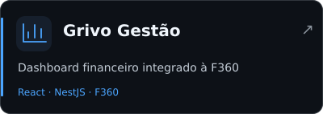
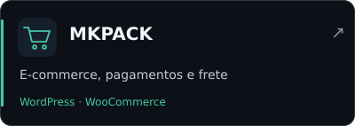
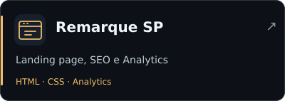
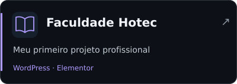
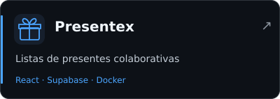
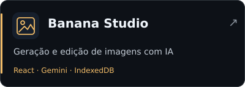
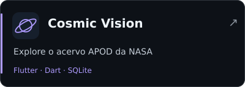
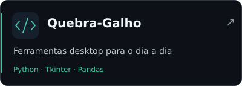

<strong>Desenvolvedor Full Stack Pleno</strong> Aplicações web · Integrações · Produtos digitais

  
  
  

<strong>Português</strong> · <a href="README-EN_US.md">English</a>

Sou Desenvolvedor Full Stack Pleno na [Alfa Consultoria SAP](https://alfaerp.com.br/), trabalhando com portais web e APIs integrados ao **SAP Business One**. Também desenvolvo **projetos freelance**: dashboards financeiros, sites institucionais e e-commerces.

## 🛠️ Tecnologias

<strong>Web, backend e dados</strong>

  <picture>
    <source media="(prefers-color-scheme: dark)" srcset="https://skillicons.dev/icons?i=ts,js,react,nextjs,tailwind,nodejs,nestjs,postgres&amp;theme=dark&amp;perline=8">
    
  </picture>

<strong>Infraestrutura, automação e outras experiências</strong>

  <picture>
    <source media="(prefers-color-scheme: dark)" srcset="https://skillicons.dev/icons?i=docker,linux,cloudflare,wordpress,py,flutter,cs,dotnet&amp;theme=dark&amp;perline=8">
    
  </picture>

  <picture>
    <source media="(prefers-color-scheme: dark)" srcset="https://skillicons.dev/icons?i=vite,mysql,supabase,nginx,git,github,dart,php&amp;theme=dark&amp;perline=8">
    
  </picture>

SAP Business One / Service Layer · SQL Server · MySQL · Supabase · WooCommerce

## 💼 Na Alfa

- **Portais corporativos:** React/TypeScript, APIs NestJS e integrações com SAP Business One.
- **Compras e despesas:** solicitações, cotações, pedidos, aprovações e reembolsos.
- **Automação e operação:** importação de planilhas, processamento de dados e ferramentas de etiquetas.

## 🚀 Entregas profissionais

  
  

  
  

<strong>Ver minha contribuição em cada entrega</strong>

| Projeto | Minha entrega |
| --- | --- |
| **Grivo Gestão** | Dashboard financeiro integrado à API F360, com backend em NestJS, frontend React/Vite e monorepo pnpm/Turborepo. |
| [MKPACK](https://mkpack.marcuspaixao.com.br) | E-commerce em WordPress/WooCommerce, com integrações de pagamento e frete via Mercado Pago e Melhor Envio. |
| [Remarque SP](https://remarquesp.com.br/) | Landing page em HTML/CSS, configuração de SEO, preparação para Google Ads e integração com Analytics. |

Meu primeiro projeto profissional foi o site da **Faculdade Hotec**, em WordPress, Elementor e WooCommerce. A [versão preservada no portfólio](https://hotec.marcuspaixao.com.br/) registra essa etapa da minha trajetória.

[Conheça esses trabalhos no meu portfólio →](https://marcuspaixao.com.br)

## 📂 Projetos com código aberto

  
  

  
  

<strong>Explorar funcionalidades, stack e outros projetos</strong>

| Projeto | O que construí | Stack |
| --- | --- | --- |
| [Presentex](https://github.com/Vini-Paixao/Presentex) | Listas de presentes colaborativas, autenticação, captura de dados de produtos e notificações no WhatsApp. | React · TypeScript · Supabase · Docker |
| [Banana Studio](https://github.com/Vini-Paixao/Banana-Studio) | Geração e edição de imagens com Gemini, com galeria persistida no navegador via IndexedDB. | React · TypeScript · Gemini API |
| [Cosmic Vision](https://github.com/Vini-Paixao/Cosmic-Vision) | Aplicativo para explorar o acervo APOD da NASA, com favoritos, download e persistência local. | Flutter · Dart · SQLite |
| [Quebra-Galho](https://github.com/Vini-Paixao/Quebra-Galho) | Ferramenta desktop para tarefas com SQL, XML/JSON, datas e exportação de dados, criada a partir de necessidades do trabalho. | Python · Tkinter · Pandas |

Outros projetos: [Finz](https://github.com/Vini-Paixao/Finz), com gestão financeira e integração Pluggy; [API-SP](https://github.com/Vini-Paixao/API-SP), uma API de calendário com scraping; e [PimVIII API](https://github.com/Vini-Paixao/PimVIII-API), um projeto acadêmico em ASP.NET Core e PostgreSQL.

## 📊 GitHub em números

  <picture>
    <source media="(prefers-color-scheme: dark)" srcset="https://github-stats-extended.vercel.app/api?username=Vini-Paixao&amp;disable_animations=true&amp;locale=pt-br&amp;show_icons=true&amp;hide_rank=true&amp;include_all_commits=true&amp;theme=dark_github">
    
  </picture>
  <picture>
    <source media="(prefers-color-scheme: dark)" srcset="https://github-stats-extended.vercel.app/api/top-langs/?username=Vini-Paixao&amp;disable_animations=true&amp;locale=pt-br&amp;layout=compact&amp;langs_count=8&amp;hide=CMake%2CC%2B%2B&amp;theme=dark_github">
    
  </picture>

  <picture>
    <source media="(prefers-color-scheme: dark)" srcset="https://streak-stats.demolab.com/?user=Vini-Paixao&amp;hide_border=false&amp;mode=weekly&amp;locale=pt_BR&amp;theme=github-dark-blue">
    
  </picture>

Como ler esses cards

O gráfico de linguagens reflete a composição do código público, não o nível de domínio. CMake e C++ foram ocultados para reduzir ruído de arquivos gerados. O card de atividade mostra uma sequência de **semanas** com contribuições. Estatísticas públicas não representam todas as entregas em repositórios privados e sistemas corporativos.

## 🎓 Formação

**Análise e Desenvolvimento de Sistemas — UNIP** · concluído em julho de 2026.  
**Técnico em Desenvolvimento de Sistemas — Etec Prof. Basilides de Godoy.**

<a href="mailto:contato@marcuspaixao.com.br">Vamos conversar sobre seu próximo projeto →</a>

